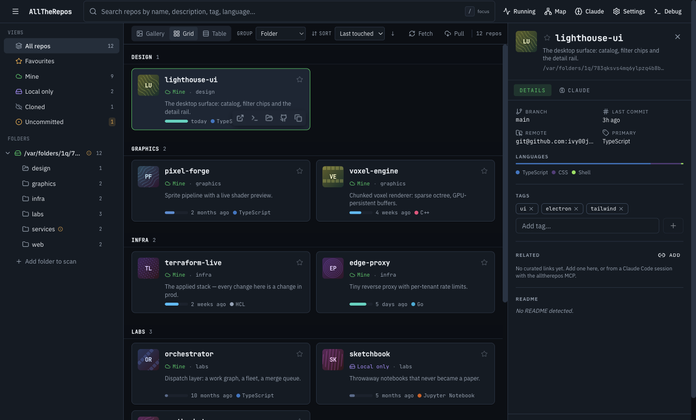
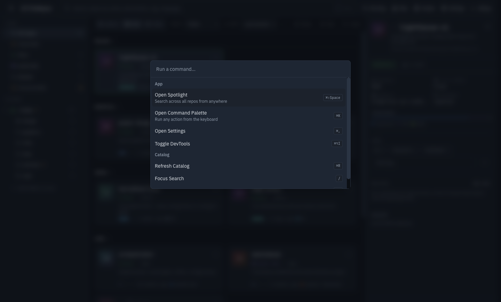
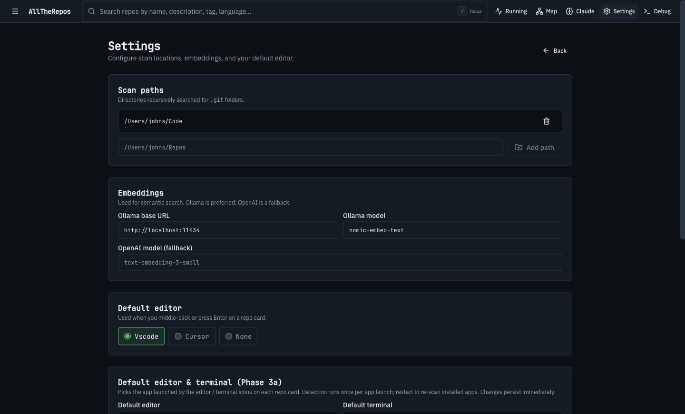
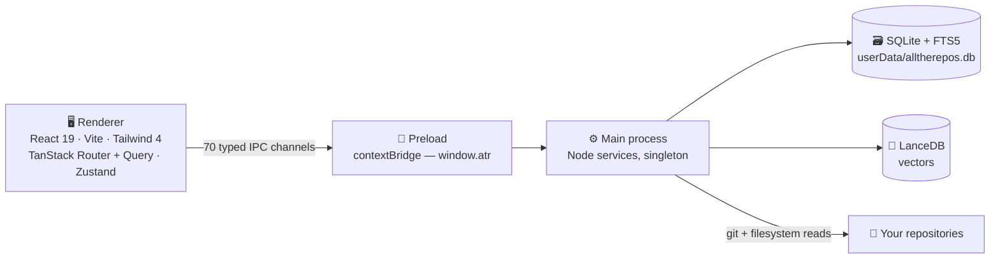

<div align="center">



# 🗂️ AllTheRepos

### *One window for every git repository on your machine.*

**Point it at the folders where you keep code. AllTheRepos scans them, indexes them into SQLite + FTS5 with optional vector search, and gives you a single local-first window to search, filter, tag, and open hundreds — or thousands — of repositories. No account, no telemetry, no cloud index: the whole catalog lives in one SQLite file on your own disk.**

<p align="center">
  <a href="https://github.com/ivy00johns/AllTheRepos/actions/workflows/ci.yml"></a>
  <a href="https://github.com/ivy00johns/AllTheRepos/actions/workflows/release.yml"></a>
  
  
  
  
  
  
  
  <a href="https://buymeacoffee.com/john00ivyz"></a>
</p>

<p align="center">
  <a href="#-why-alltherepos">Why AllTheRepos</a> ·
  <a href="#-quick-start">Quick Start</a> ·
  <a href="#%EF%B8%8F-the-app">The App</a> ·
  <a href="#-architecture">Architecture</a> ·
  <a href="#-testing">Testing</a> ·
  <a href="#-releasing">Releasing</a> ·
  <a href="#-known-issues">Known Issues</a> ·
  <a href="#-documentation">Docs</a> ·
  <a href="#-support">Support</a>
</p>

</div>

---

## ✨ Why AllTheRepos

Most repository tools answer *"what is in this repo?"*. AllTheRepos answers the question you actually ask forty times a day: **"which repo was that?"**

- 🔍 **Search across all of them at once** — FTS5 by default, and hybrid FTS + vector ranking (reciprocal rank fusion) when Ollama is running.
- 📁 **The folders you already have** — scan roots, an expandable rail, folder labels, and a per-folder filter. No import, no reorganising, no `~/code` migration.
- 🏷️ **Your own vocabulary** — tags you add, favourites, groups, and curated links between repositories you know belong together.
- 🕒 **Recency you can read at a glance** — a single-hue activity ramp from "minutes ago" to "dormant", plus dirty-tree and missing-from-disk marks.
- 🧭 **Ownership marks** — *mine*, *cloned*, *local only*, derived from the git remote, so a fork can never be mistaken for your work.
- 🖥️ **A real desktop app** — Electron, not a browser tab: menu-bar presence, a global spotlight window, native menus, and dev-server/port detection for the repos you are actually running.
- 🔒 **Local-first, and provably so** — every git command, filesystem write and network request is inventoried with citations in [`docs/COMMAND-DISCLOSURE.md`](./docs/COMMAND-DISCLOSURE.md).
- 📦 **A release pipeline that ships itself** — tag a version and a GitHub Actions runner typechecks, tests, packages a DMG + ZIP, publishes them to a public releases repo, and verifies the update feed it just wrote.

**Status:** the desktop app boots, the type-safe IPC layer works end to end, and the catalog runs against a migrated SQLite + LanceDB store. Phases 0–2 are structurally complete and Phase 3 (deep integrations) is wired; several Phase 1–3 surfaces are still stubbed, and [`docs/PLAN.md`](./docs/PLAN.md) keeps the honest, verified phase-by-phase list rather than this paragraph. This is **alpha software that touches your entire repository collection** — read the disclosure above before pointing it at your machine.

The current release is [`v0.1.2`](https://github.com/ivy00johns/alltherepos-releases/releases) — download the **`.dmg`**; the `.zip`, `.blockmap` and `latest-mac.yml` beside it are the update feed, not another installer. It is ad-hoc signed and not notarised, and its updater **checks** for new versions but cannot install them: see [Releasing](#-releasing).

---

## 🚀 Quick Start

### Prerequisites

| You need | Why |
| ------------------------------ | --------------------------------------------------------------------------- |
| **Node.js ≥22** | Vite 7 calls `crypto.hash()`, which does not exist in Node 21.0–21.6. An `.nvmrc` is checked in — run `nvm use`. `engines.node` enforces it at install time. |
| **pnpm ≥9** | Pinned through the `packageManager` field. |
| **macOS** | Required for `pnpm electron:pack` / `dist` (DMG output). The dev app builds anywhere Electron does, but only macOS is exercised. |
| **Xcode command line tools** | `better-sqlite3` and `find-git-repositories` are compiled locally. On Xcode 26 set `SDKROOT` — see [Known Issues](#%EF%B8%8F-known-issues). |
| **Optional: [Ollama](http://localhost:11434)** | Embedding-based hybrid search. Without it, search degrades to FTS5 only. |

### Run it

```bash
nvm use                            # Node 22 from .nvmrc
pnpm install                       # installs the workspace
pnpm electron:dev                  # rebuilds natives, then launches the app
```

> **First boot takes ~30s** — `electron:dev` chains `electron:rebuild` to compile the native modules against Electron's ABI before the window appears. Later boots are fast.
>
> If you see `TypeError: crypto.hash is not a function`, your shell is on Node ≤21.6. Run `nvm use` and retry.

### First run, in the app

1. **Add a scan folder** (rail → *Add folder to scan*) — a directory that contains repositories, e.g. `~/Code`.
2. Press **Scan**. The scanner walks the tree in a worker thread and writes each repository into the catalog.
3. Use the top-bar field to search, and `⌘K` to run a command.

---

## 🖥️ The App

<div align="center">



</div>

Everything is keyboard-reachable: **`⌘K`** for the command palette, **`g s`** to jump to settings, **`j`/`k`** to move through the grid, **Enter** to open the selected repository — plus a menu-bar presence and a spotlight window for a search that does not raise the main window.

<div align="center">



</div>

Settings owns the scan roots and ignore globs, the embedding provider, the editor to open repos in, your git identities, and the *Check for updates* control that reads the public update feed.

> The screenshots above are generated, not staged: `node scripts/make-readme-shots.mjs` launches the real app against a throwaway profile seeded with a **demo library**, and refuses to write the files if any repository outside that demo data appears on screen — these images are published, and this repository is not. It checks the native ABI first, because the app exiting for that reason looks like nothing at all.

---

## 🧬 Architecture

Three TypeScript codebases share `src/shared/` — the types, Zod schemas and IPC channel constants that both sides agree on.



| Layer | What lives there |
| ---------------------- | ------------------------------------------------------------------------------------------------------------------------------------------------------------------- |
| **`src/shared/`** | Types, Zod schemas and the IPC channel table. The single source of truth for both processes. |
| **`src/main/`** | The Node half: catalog (Drizzle + better-sqlite3 + FTS5), scan (`find-git-repositories` in a worker thread), search (FTS + LanceDB hybrid with RRF), git (`simple-git`), settings (atomic-rename JSON store), groups, process/port detection, the tray and the spotlight window. |
| **`src/preload/`** | `contextBridge.exposeInMainWorld('atr', …)`. The renderer reaches the main process **only** through `window.atr.<namespace>.<method>()`. |
| **`src/renderer/`** | A pure web app: Vite + React 19 + Tailwind 4 + shadcn primitives + TanStack Router (memory history) + TanStack Query + Zustand. |

**16 namespaces and 70 IPC channels** are wired, each with Zod-validated input *and* output plus a frame-origin check. See [`contracts/ipc.v3b.md`](./contracts/ipc.v3b.md) (current) and [`contracts/data-layer.v1.md`](./contracts/data-layer.v1.md).

### Routes

| Route | What it shows |
| ------------- | --------------------------------------------------------------------- |
| `/` | The three-column catalog: folder rail, repo grid, detail panel |
| `/repos/$slug` | A standalone repository detail page |
| `/graph` | The curated relationship graph between repositories |
| `/claude` | Claude Code tab — projects, sessions, usage |
| `/processes` | Running dev servers and port detection |
| `/settings` | Scan paths, ignore globs, providers, identities, updates |
| `/debug` | The Phase 0 ping/pong card — useful when nothing else works |

### Where your data lives

- **`~/Library/Application Support/AllTheRepos/`** (`app.getPath('userData')`) holds `alltherepos.db` (SQLite + FTS5), the Lance vector store, and `settings.json`.
- On first boot, if `~/.alltherepos/` exists, that legacy SQLite / Lance / notes data is **copied** (never moved) into the new location and a `MIGRATED` sentinel is written. The original is preserved for muscle-memory CLI access.

---

## 🧰 Tech Stack

| Component | Technology |
| ---------------------- | -------------------------------------------------------------------- |
| Shell | Electron 36 / electron-vite / electron-builder |
| UI | React 19 · Vite 7 · Tailwind 4 · shadcn primitives |
| Routing & state | TanStack Router (memory history) · TanStack Query · Zustand |
| Catalog store | SQLite via `better-sqlite3` + Drizzle, with FTS5 full-text search |
| Vector search | LanceDB, embeddings through Ollama (`nomic-embed-text` by default) |
| Scanning | `find-git-repositories` in a Node worker thread |
| Git | `simple-git` |
| Contracts | Zod schemas shared by both processes |
| Testing | Vitest (unit) · Playwright (Electron E2E) |
| CI / releases | GitHub Actions on `macos-14`, publishing to a public releases repo |

---

## 📂 Project Structure

```
.
├── src/
│   ├── shared/            # types + Zod schemas + IPC channel constants (both processes)
│   ├── main/              # Node main process
│   │   ├── index.ts       # app boot, single-instance lock, migration
│   │   ├── window/        # main window, spotlight, tray popover
│   │   ├── security/      # CSP + shell.openExternal allowlist
│   │   ├── ipc/           # ipcMain.handle per namespace
│   │   ├── services/      # catalog, scan, search, git, settings, groups, launcher…
│   │   ├── workers/       # scanner.worker.ts
│   │   └── db/            # client + schema + queries + migrations
│   ├── preload/           # contextBridge typed API
│   └── renderer/          # Vite + React + TanStack
│       ├── routes/        # index, repos.$slug, graph, claude, processes, settings, debug
│       ├── components/    # ui primitives + catalog, groups, search, layout, palette…
│       ├── hooks/ stores/ lib/ styles/
│       └── fonts/         # IBM Plex Sans + JetBrains Mono (bundled)
├── contracts/             # IPC + data-layer contracts, types, schema
├── mcp/                   # MCP server exposing curated repo relationships
├── design-system/         # design tokens and the alltherepos theme
├── drizzle/               # SQLite migrations
├── docs/                  # PLAN, REMAINING-WORK, FUTURE, RELEASING, COMMAND-DISCLOSURE…
├── scripts/               # native-ABI guard, release tooling, README screenshot generator
├── tests/
│   ├── unit/              # Vitest — services, IPC, renderer logic, scripts
│   ├── e2e/               # Playwright Electron specs
│   └── helpers/
├── resources/             # icon.icns, tray art, entitlements
├── .github/workflows/     # ci.yml, release.yml
└── electron-builder.yml   # DMG + ZIP packaging and the update feed
```

---

## 🧪 Testing

```bash
pnpm test                  # Vitest, 54 files · 1,185 tests (flips natives to host ABI first)
pnpm typecheck             # tsc over all three tsconfigs
pnpm test:electron-e2e     # Playwright against a real Electron window
pnpm test:packaged-update  # opt-in: the packaged .app's anonymous update check
pnpm test:full             # unit + Electron E2E
pnpm links:check           # resolve every external link in the Markdown (hits the network)
```

Current status (2026-10-06): **1,185 unit tests in 54 files, 0 failures** and **0 typecheck errors across three tsconfigs**, both verified locally. The same gates run on `macos-14` for every push and pull request; the last Electron E2E job there finished **8 passed, 2 skipped** (10 tests in 27s). That suite launches a real window and drives it over the debugger protocol, so a runner's GUI session is sufficient.

`pnpm links:check` is the one gate that needs the internet, so it is its own CI job: it resolves every external link in the Markdown and fails on a **404**, which is how a changelog entry pointing at a deleted release or a contract citing a page upstream moved out from under it gets caught. A rate limit, a bot wall or a timeout is reported and does not fail — a check that could not run is not a verdict.

### The dual-rebuild dance

`better-sqlite3` and `find-git-repositories` ship one set of `.node` binaries, and host Node and Electron bundle different Node versions. `scripts/ensure-native-abi.mjs` probes the actual ABI and rebuilds only on a mismatch, which is why every command above is safe to run back to back:

```bash
node scripts/ensure-native-abi.mjs host       # what `pnpm test` runs first
node scripts/ensure-native-abi.mjs electron   # what the app and the E2E suite need
```

> `qa-report.json` is a unit-layer gate, not a ship signal — see the caveat in [`docs/PLAN.md`](./docs/PLAN.md).

---

## 📦 Releasing

```bash
pnpm release:next          # derive the next version + changelog section from the commits since the last tag
pnpm release:check         # guard tag / version / changelog agreement
pnpm release:verify        # read a published release back: DMG, ZIP and a coherent latest-mac.yml
git tag v0.1.3 && git push origin v0.1.3
```

Pushing a `v*` tag runs [`.github/workflows/release.yml`](./.github/workflows/release.yml), which typechecks and tests the tagged commit, packages the DMG and the ZIP, uploads them to a **draft** in the public releases-only repo, verifies the draft, attaches the changelog, publishes it, and verifies it again in the state users actually see.

The artifacts deliberately do **not** land in this repository. They go to [`ivy00johns/alltherepos-releases`](https://github.com/ivy00johns/alltherepos-releases) — the repo the app's updater reads — so anyone who installs a build can check for updates anonymously while the source stays private. Two things about those builds:

- They are **ad-hoc signed and not notarised**. Download the DMG, then right-click the app → **Open** once; after that it launches normally.
- The updater **checks** for new versions but cannot install them — this build has no Developer ID, so Squirrel.Mac has nothing it is allowed to apply.

[`docs/RELEASING.md`](./docs/RELEASING.md) is the full procedure, including the traps that cost real debugging time: `electron-updater` caches the app version at construction, drafts are invisible to `GET /releases/tags/{tag}`, and a green workflow run is not by itself proof that anything was uploaded.

---

## 🩺 Known Issues

<details>
<summary><b>Native rebuilds fail on Xcode 26 with <code>tapi error: malformed file</code></b></summary>

The linker picks up a command-line-tools SDK that Xcode's `clang` cannot parse. Point `SDKROOT` at the Xcode SDK for `pnpm test` and any native rebuild:

```bash
export SDKROOT=/Applications/Xcode.app/Contents/Developer/Platforms/MacOSX.platform/Developer/SDKs/MacOSX26.5.sdk
```

Tracked as ATR-057 in [`docs/REMAINING-WORK.md`](./docs/REMAINING-WORK.md).
</details>

<details>
<summary><b>The dual-rebuild dance (why a bare <code>pnpm vitest</code> can fail)</b></summary>

Tests run under host Node; the app runs under Electron's bundled Node. They need different `.node` binaries, so switching between them normally requires a rebuild. `pnpm test` and `pnpm electron:dev` both call `scripts/ensure-native-abi.mjs` first, which probes by *loading* the module (a bare `require` succeeds against a foreign ABI, so it would lie) and rebuilds only when the ABI actually disagrees. `pnpm install` deliberately does **not** rebuild, so the default state is test-ready.
</details>

<details>
<summary><b>The scanner test can flake on hosts with 1Password GPG signing</b></summary>

`tests/git/scanner.test.ts` commits in temp repositories with `simple-git`. If your global `commit.gpgsign = true` routes through 1Password's agent, those commits fail. Workaround: `git config --global commit.gpgsign false`, or pass `--no-gpg-sign`.
</details>

<details>
<summary><b>No <code>LICENSE</code> file</b></summary>

The repository is private and has no license yet, so no license badge is claimed above and no reuse rights are granted. Add a `LICENSE` before making the source public.
</details>

<details>
<summary><b>The two workflow badges resolve only with repository access</b></summary>

GitHub renders its own workflow badges through an authenticated-only endpoint for private repositories, so until this repository is public (or you are signed in with access) those two badges read as unavailable. Every other badge is static and always renders.
</details>

---

## 📖 Documentation

| Doc | Purpose |
| ---------------------------------------------------------------------------------- | ------------------------------------------------------------ |
| [`START-HERE.md`](./START-HERE.md) | **Front door** — status, doc ownership map, how work flows in |
| [`docs/PLAN.md`](./docs/PLAN.md) | **Strategic** roadmap, honest phase status, closure log |
| [`docs/REMAINING-WORK.md`](./docs/REMAINING-WORK.md) | **Tactical ledger** — every open item, ID'd (`ATR-###`) |
| [`docs/FUTURE.md`](./docs/FUTURE.md) | **Frontier** — Phase 4/5/6 and parked decisions |
| [`docs/RELEASING.md`](./docs/RELEASING.md) | Cutting a release, and the traps in the pipeline |
| [`docs/COMMAND-DISCLOSURE.md`](./docs/COMMAND-DISCLOSURE.md) | **Disclosure** — every command, write and request, cited |
| [`CHANGELOG.md`](./CHANGELOG.md) | What changed, per release |
| [`NEW-PLAN.md`](./NEW-PLAN.md) | Frozen architecture and feature design brief |
| [`mcp/README.md`](./mcp/README.md) | The MCP server for curated repo relationships |
| [`contracts/ipc.v3b.md`](./contracts/ipc.v3b.md) | Current IPC channel contract (older: v1, v3) |
| [`contracts/data-layer.v1.md`](./contracts/data-layer.v1.md) | SQLite + LanceDB + settings locations and migration |
| [`docs/agents/`](./docs/agents/) | Project agent-config — context, contracts, work tracker |
| [`docs/audits/`](./docs/audits/) | Point-in-time ground-truth audit reports |
| [`docs/archive/`](./docs/archive/) | Superseded planning docs |

---

## ☕ Support

AllTheRepos is built nights-and-weekends and given away. If it saved you from *"which repo was that?"* — or you just want to see it finished — a coffee keeps the lights on:

<div align="center">

<a href="https://buymeacoffee.com/john00ivyz">
  
</a>

</div>

Other ways to help, all free: star the releases repo, tell someone with a `~/Projects` folder full of mystery repos, or file a concrete bug against [`docs/REMAINING-WORK.md`](./docs/REMAINING-WORK.md).

---

<div align="center">

<sub>Built by <a href="https://linktr.ee/john.stennett">John Stennett</a> · Austin, TX · 🗂️ local-first, always</sub>

</div>
